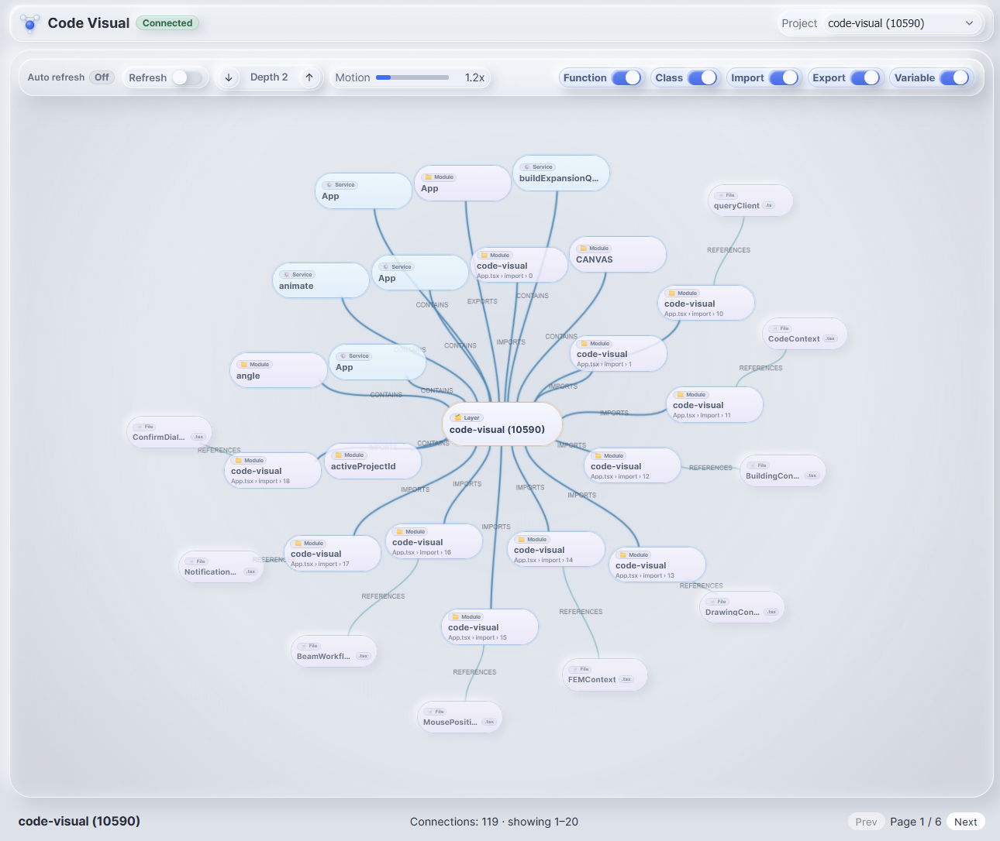

# Code Visual

<p align="center">
	<strong>Navigate your codebase as a living graph.</strong><br/>
	Powered by Memgraph, rendered with a responsive interactive canvas.
</p>

<p align="center">
	
	
	
	
	
</p>

<p align="center">
	
</p>

<p align="center">
	Works with <a href="https://github.com/lexCoder2/code-graph-server"><strong>code-graph-server</strong></a> to ingest project structure and relationships into Memgraph.
</p>

---

## ✨ Why Code Visual

Code Visual helps you explore architecture, dependencies, and semantic entities in real time. It is optimized for quick navigation, high-density graph interactions, and smooth visual feedback.

| Capability | What you get |
| --- | --- |
| Live Sync | Auto-refresh from Memgraph every 5 seconds |
| Semantic Filtering | Toggle functions, classes, imports, exports, and variables |
| Smart Navigation | Depth control + subtree pruning for focused exploration |
| Stable Interaction | Depth-weighted drag propagation and smooth camera transitions |
| Precise Rendering | Dynamic edge bounds, accurate labels, and rounded-node anchoring |
| Visual Clarity | Node kind/semantic indicators for faster identification |

## 🧭 Quick Links

- [Quick Start](#-quick-start)
- [Command Batches](#-command-batches)
- [Environment](#-environment)
- [Scripts](#-scripts)
- [Interaction Guide](#-interaction-guide)
- [Architecture](#-architecture)
- [Troubleshooting](#-troubleshooting)

## 🚀 Quick Start

```bash
# 1) Install dependencies
npm install

# 2) Configure environment
cp .env.example .env

# 3) Run proxy + frontend
npm run dev:all
```

Open [http://localhost:5173](http://localhost:5173).

If Memgraph is unavailable, the UI automatically falls back to mock mode.

## 📦 Command Batches

### Batch A — Full local development

```bash
npm install
cp .env.example .env
npm run dev:all
```

### Batch B — Frontend only (proxy already running)

```bash
npm run dev
```

### Batch C — Pre-push quality checks

```bash
npm run lint
npm run build
```

### Batch D — Production preview

```bash
npm run build
npm run preview
```

## 🔐 Environment

| Variable | Default | Purpose |
| --- | --- | --- |
| `VITE_MEMGRAPH_URL` | `http://localhost:4000/query` | Frontend → proxy endpoint |
| `MEMGRAPH_BOLT_URL` | `bolt://localhost:7687` | Proxy → Memgraph Bolt |
| `MEMGRAPH_BOLT_USER` | _(empty)_ | Bolt auth username |
| `MEMGRAPH_BOLT_PASSWORD` | _(empty)_ | Bolt auth password |
| `MEMGRAPH_PROXY_PORT` | `4000` | Local proxy port |

Expected proxy response shape:

```json
{ "rows": [...] }
```

## 🛠 Scripts

- `npm run dev` — start Vite dev server
- `npm run dev:server` — start Memgraph proxy server
- `npm run dev:all` — run proxy + frontend concurrently
- `npm run build` — type-check and production build
- `npm run lint` — lint source files
- `npm run preview` — preview production build locally

## 🎮 Interaction Guide

- **Right-drag canvas** to pan
- **Mouse wheel** to zoom around pointer
- **Single-click node** to select
- **Double-click node** to expand neighborhood
- **Drag node** to reposition with connected movement propagation
- **Use top controls** for project, depth, motion, refresh, and semantic toggles

## 🧱 Architecture

- **Frontend:** React + TypeScript + Vite
- **State:** Zustand with Immer middleware
- **Layout:** `d3-force` simulation + worker offload
- **Pipeline:** `Memgraph -> proxy -> graph store -> layout worker -> canvas`

Further reading:

- [docs/architecture.md](docs/architecture.md)
- [docs/performance-plan.md](docs/performance-plan.md)

## 🧩 Troubleshooting

- **Disconnected / empty graph:** validate `MEMGRAPH_BOLT_URL` and `MEMGRAPH_PROXY_PORT`
- **Network/CORS errors on `VITE_MEMGRAPH_URL`:** ensure proxy is running on configured host/port
- **Slower interaction on dense graphs:** reduce connection depth or narrow semantic filters
- **Local build failures:** rerun `npm install` and then `npm run build`
